# Credit Scoring for the Unbanked Using Mobile Money-Style Alternative Data
## Default Risk Modeling with Proxy Behavioral Features, XGBoost, and Deep Learning

**Author:** Peter Adepoju \
**Email:** petera@aims.ac.za

---

## Abstract

This project builds a credit-risk scoring workflow for a financial-inclusion setting using public proxy data and mobile-money-style feature abstractions.
Because genuine transaction-level mobile-money, USSD, airtime, and repayment records are highly sensitive, the runnable workflow uses the UCI Default of Credit Card Clients dataset and maps its repayment behavior into alternative-data-inspired credit signals.

Key results:
- XGBoost achieves ROC-AUC 0.7815, PR-AUC 0.5637, balanced accuracy 0.7134, and F1 0.5355.
- Random Forest is the strongest overall model on the final comparison table, with ROC-AUC 0.7810 and the best Brier score at 0.1702.
- The MLP reaches ROC-AUC 0.7776 and balanced accuracy 0.7102, showing that the neural network is competitive but not clearly superior.

The repository includes notebook-driven analysis, report-ready figures and tables, a Streamlit app, and an explicit ethical framing around what can and cannot be claimed from proxy data.

---

## 1. Introduction

Credit scoring can expand access to finance, but for unbanked or underbanked people the available data are often sparse, fragmented, or private.
In settings where mobile-money or digital-wallet behavior exists, alternative signals such as repayment consistency, transaction frequency, bill-payment regularity, and affordability proxies can be useful for risk modeling.

This project asks:

1. How well can behavioral repayment and transaction-style features predict default risk?
2. Do gradient-boosted trees outperform simpler interpretable baselines?
3. Does a neural-network model improve discrimination or calibration?
4. Which feature families contribute most to default prediction?
5. How should a probability threshold be chosen when false approvals and false rejections have different business costs?

Hypotheses:

- Tree-based models will outperform logistic regression on this non-linear problem.
- Probability calibration and threshold choice will materially affect business utility.
- Proxy behavioral features will carry more signal than raw nominal fields alone.

---

## 2. Data

- Primary runnable dataset: UCI Default of Credit Card Clients
- Target variable: binary default in the next period
- Main proxy source: repayment, bill, and payment histories
- Optional schema reference: `data/external/mobile_money_feature_dictionary.csv`
- Optional extension: Kaggle Home Credit Default Risk

### Important data-access position

This repository does **not** claim to contain real private mobile-money transaction records.
Instead, it uses a public credit-default dataset to develop the workflow and includes a feature dictionary describing how true mobile-money-style variables would fit into the pipeline if a legitimate private dataset were later obtained under proper consent, governance, and ethics review.

### Included data products

 - `data/raw/default_of_credit_card_clients.xls`
- `data/processed/train_split.csv`
- `data/processed/test_split.csv`
- `data/processed/test_predictions.csv`
- `data/processed/scored_inference_sample.csv`

### Data Notes

- The open dataset is suitable for a reproducible ML workflow, but it is not genuine mobile-money data.
- The project is framed as a proxy design for alternative-data credit scoring.
- Any real deployment would require a legitimate mobile-money dataset, privacy controls, and governance approval.

---

## 3. Methods

### 3.1 Data Validation and Exploratory Analysis

- Validated the raw dataset and produced data-quality summaries.
- Examined missingness, class imbalance, repayment status, bill-payment behavior, and default distributions.
- Reviewed relationships between utilization proxies and repayment regularity.

### 3.2 Feature Engineering

- Built mobile-money-style behavioral proxy features from repayment and transaction-like histories.
- Created ratios, volatility measures, delinquency counts, recency indicators, and affordability proxies.
- Added group labels for fairness and subgroup error diagnostics where available.

### 3.3 Modeling

The project includes:

- logistic regression
- random forest
- XGBoost
- multilayer perceptron

### 3.4 Evaluation

- ROC-AUC
- PR-AUC
- Brier score
- log loss
- F1
- precision
- recall
- balanced accuracy
- calibration analysis
- threshold-cost analysis
- group error diagnostics

---

## 4. Results

### 4.1 Exploratory Findings


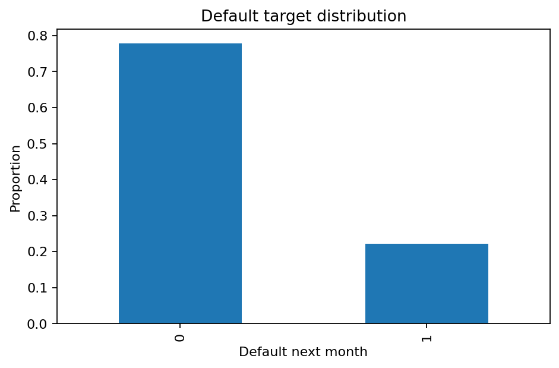

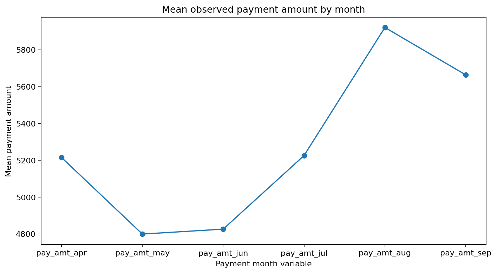

The exploratory analysis shows strong class imbalance, clear variation in repayment behavior, and meaningful separation between lower-risk and higher-risk profiles.

### 4.2 Behavioral Signals

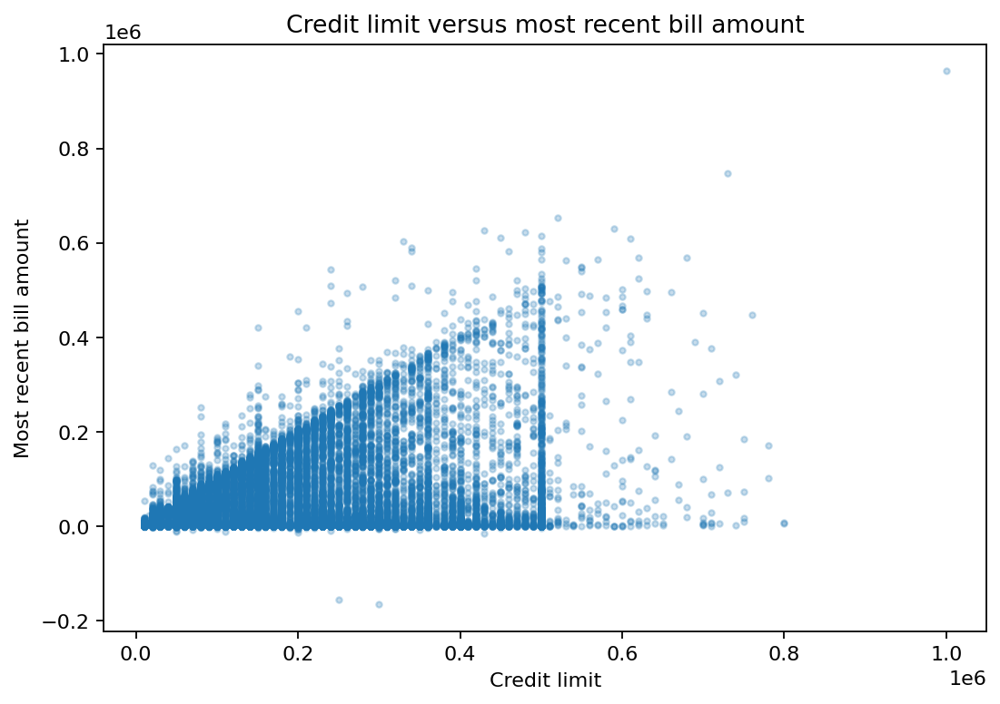

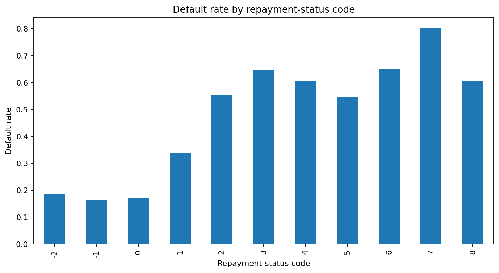

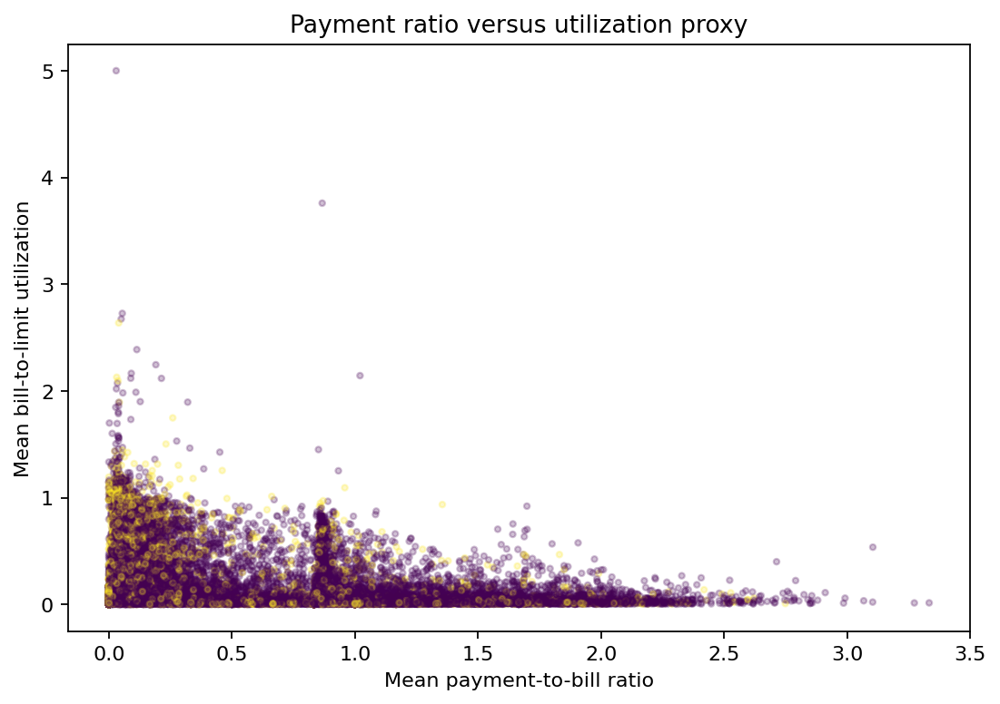

These figures support the core idea behind the project: repayment structure and utilization-style behavior are informative risk signals.

### 4.3 Model Performance

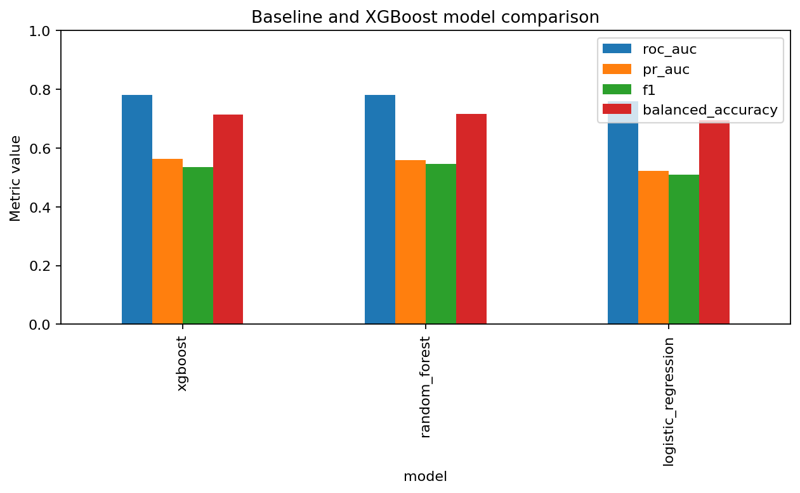

| Model | ROC-AUC | PR-AUC | Brier Score | Log Loss | F1 | Precision | Recall | Balanced Accuracy |
|-------|---------|--------|-------------|----------|----|-----------|--------|-------------------|
| Random Forest | 0.7810 | 0.5591 | 0.1702 | 0.5209 | 0.5466 | 0.4994 | 0.6036 | 0.7159 |
| XGBoost | 0.7815 | 0.5637 | 0.1794 | 0.5424 | 0.5355 | 0.4604 | 0.6398 | 0.7134 |
| MLP | 0.7776 | 0.5578 | 0.1856 | 0.5573 | 0.5295 | 0.4491 | 0.6451 | 0.7102 |
| Logistic Regression | 0.7604 | 0.5224 | 0.1888 | 0.5702 | 0.5101 | 0.4393 | 0.6081 | 0.6939 |

### 4.4 Calibration and Thresholding

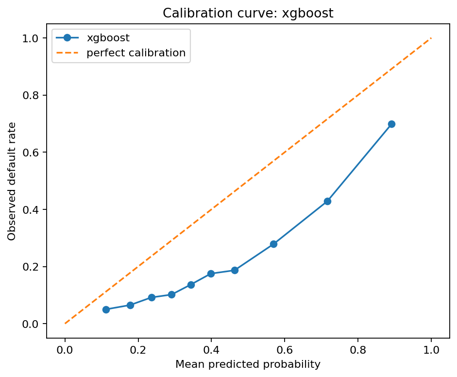

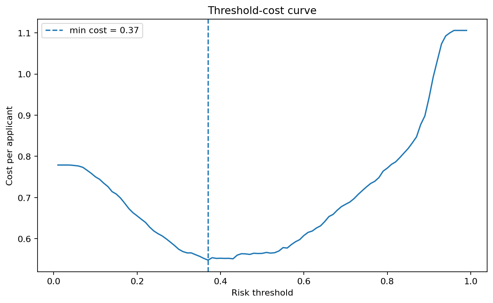

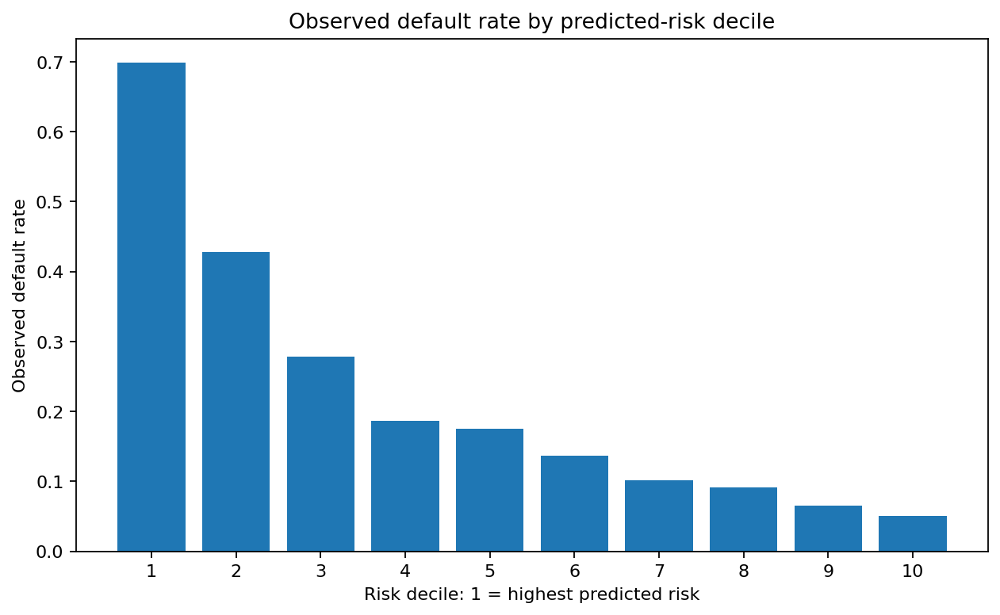

The calibration and threshold analysis show that model ranking is not enough on its own.
Decision thresholds and probability quality matter when false approvals and false rejections have different costs.

### 4.5 Final Comparison

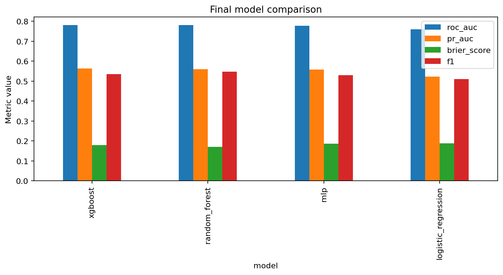

Random Forest is the strongest overall model on the final comparison table, while XGBoost offers the best ROC-AUC and PR-AUC.
That makes the choice of "best" model partly a business decision rather than a purely statistical one.

### 4.6 Deep Learning

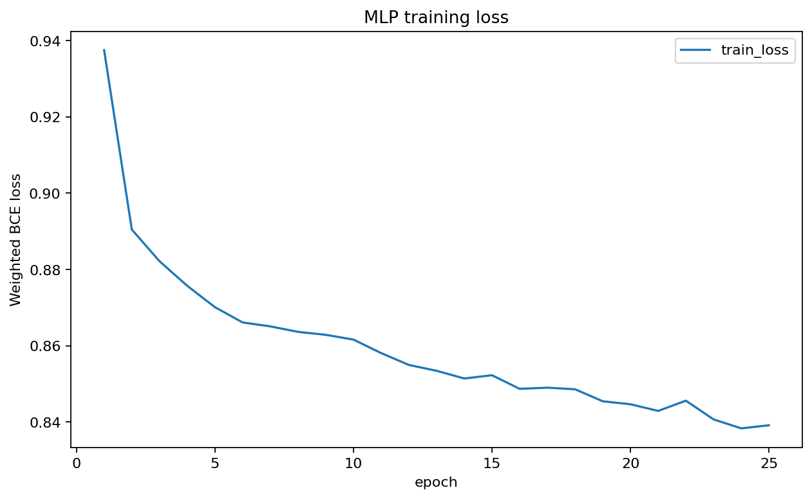

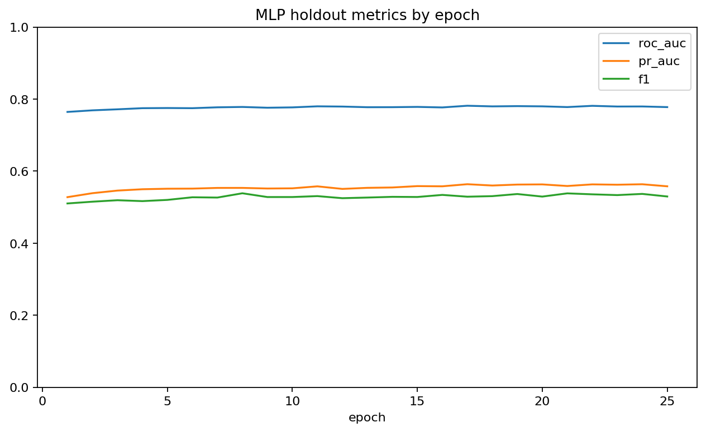

The neural network trains successfully and reaches competitive performance, but it does not clearly dominate the tree-based models.

---

## 5. Discussion

1. A public credit-default dataset can support a realistic proxy workflow for mobile-money-style credit scoring.
2. Tree-based models are the strongest practical choice in this repository.
3. Calibration and threshold selection are critical for deployment-style decisions.
4. The project's ethical framing is as important as the technical model comparison.

Recommendations:

1. Use Random Forest or XGBoost as the current best practical baseline.
2. Prefer calibrated probability outputs over hard labels alone.
3. Treat subgroup diagnostics as a required step before any operational use.
4. Replace the proxy dataset with a legitimate mobile-money dataset only if privacy, consent, and governance are in place.

---

## 6. Limitations

- The main dataset is a public proxy, not true mobile-money transaction data.
- The task is credit-card default, not a live digital-loan or wallet-default problem.
- Fairness evidence is limited by the available proxy variables.
- Any real deployment would require consent-aware data access and domain validation.

---

## 7. Reproducibility

```bash
python -m venv .venv
source .venv/bin/activate  # Windows: .venv\\Scripts\\activate
pip install --upgrade pip
pip install -r requirements.txt
```

To run the full workflow:

```bash
python run_all.py
```

---

## 8. Project Structure

```text
credit-scoring-unbanked-mobile-money/
|-- app/                      # Streamlit dashboard
|-- data/                     # Raw, interim, processed, and external data
|-- models/                   # Saved pipelines and trained artifacts
|-- notebooks/                # Notebook-driven workflow
|-- reports/                  # Figures and report-ready tables
|-- scripts/                  # Download and utility scripts
|-- src/project_package/      # Reusable Python package
|-- tests/                    # Automated checks
|-- run_all.py                # Workflow entrypoint
`-- README.md
```

---

## 9. Figures

The most important report figures are included below:

- [Missingness by variable](reports/figures/01_missingness_by_variable.png)
- [Default target distribution](reports/figures/02_default_target_distribution.png)
- [Credit limit vs recent bill](reports/figures/02_credit_limit_vs_recent_bill.png)
- [Payment ratio vs utilization](reports/figures/03_payment_ratio_vs_utilization.png)
- [Baseline model comparison](reports/figures/04_baseline_xgboost_model_comparison.png)
- [Calibration curve](reports/figures/06_calibration_curve_xgboost.png)
- [Threshold cost curve](reports/figures/06_threshold_cost_curve_xgboost.png)
- [Final model comparison](reports/figures/06_final_model_comparison.png)

---

## 10. Report and Demo

- [Reports folder](reports/README.md)
- [Notebook guide](notebooks/README.md)
- [Data notes](data/README.md)

The repository is designed as a notebook-first project with report-ready outputs, model artifacts, and a Streamlit app for exploration.

---

## 11. License

MIT License
