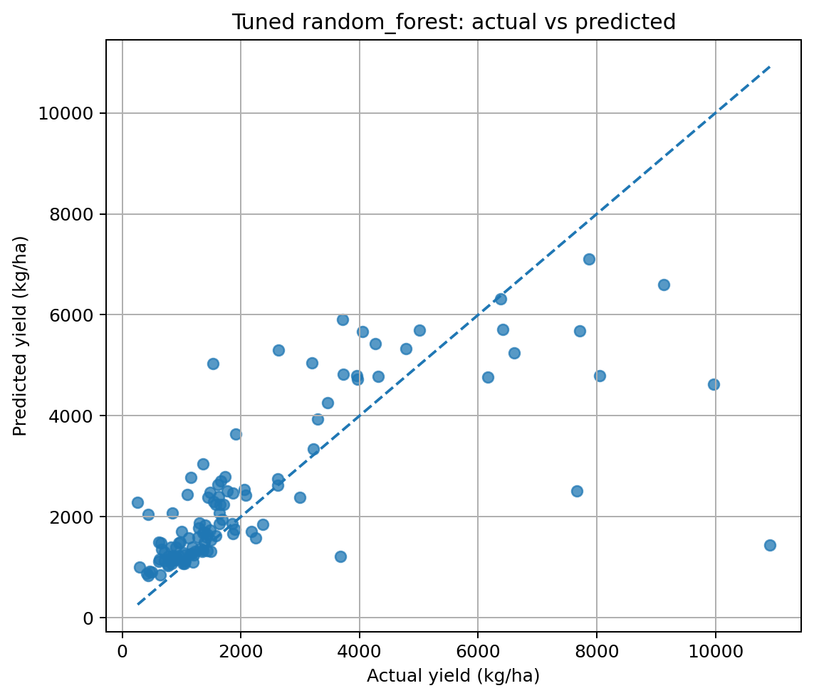
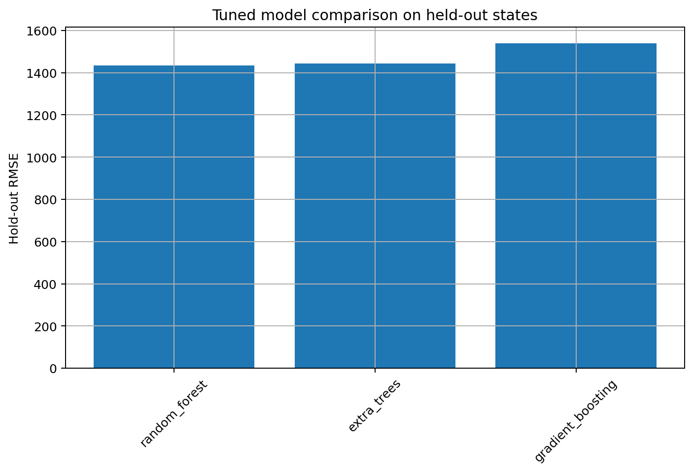
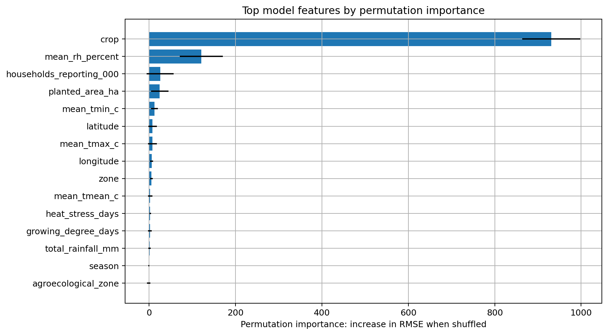
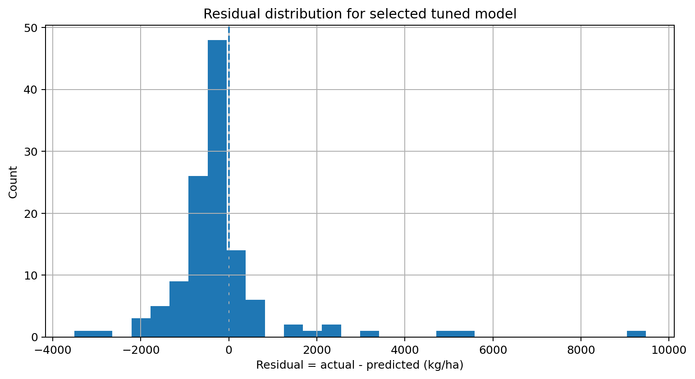
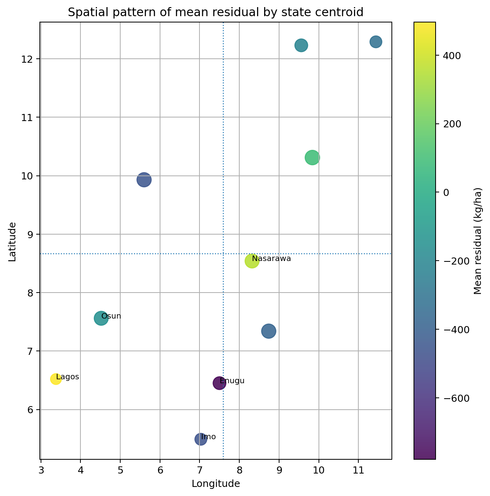

# Nigeria Crop Yield GeoAI
## Predicting and Explaining Crop Yield Across Nigerian States Using Survey, Climate, and Remote Sensing Features

**Author:** Peter Adepoju \
**Email:** petera@aims.ac.za

---

## Abstract

This project analyzes crop yield across Nigeria using the NBS National Agricultural Sample Survey 2022/2023, state metadata, climate covariates, and Sentinel-2 vegetation features.
The goal is to build a leakage-aware machine learning workflow that can predict `yield_kg_ha` and explain where the model succeeds or fails.

Key results:
- The repository covers 37 states, 22 crops, 490 state-level yield rows, and 1,053 processed rows.
- Random Forest is the best tuned model, with RMSE 1,433.59, MAE 808.71, and R2 0.535.
- Extra Trees is a close second, with RMSE 1,442.53, MAE 831.85, and R2 0.529.
- Gradient Boosting reaches RMSE 1,538.65, MAE 901.20, and R2 0.465.

---

## 1. Introduction

Crop yield in Nigeria varies by geography, rainfall, temperature, seasonality, crop type, and local agricultural conditions. A single national average hides major state-level differences, so this project asks a practical question:

Can we combine agricultural survey tables, climate signals, and remote sensing features to model crop yield across Nigerian states and coarse agroecological zones?

Research questions:

1. Which features are most useful for predicting state-level crop yield?
2. Do climate and Sentinel-2 features improve performance over survey data alone?
3. Where does the model make the largest errors, and are those errors concentrated by crop or zone?

Hypotheses:

- Tree-based models will outperform simpler baselines because the problem is nonlinear.
- Leakage-prone variables such as harvested area and harvested quantity must be excluded to avoid inflated performance.
- Error patterns will vary across crops and agroecological zones rather than being uniform.

---

## 2. Data

- Dataset: NBS National Agricultural Sample Survey 2022/2023
- Core source file: `data/raw/nbs/nass_report_tables_2022_2023.xlsx`
- Processed table: `data/processed/nbs_crop_yield_state_zone_2022_2023.csv`
- Optional climate source: NiMet station observations or NASA POWER fallback
- Optional remote sensing source: Sentinel-2 L2A vegetation indices
- Target variable: `yield_kg_ha`

### Included and optional data

- Survey features: crop, season, state, zone, planted area, households reporting crop
- Agroecological features: coarse state-level zone and state centroid coordinates
- Climate features: rainfall, temperature, humidity, growing degree days, heat-stress days
- Sentinel-2 features: NDVI, EVI, NDWI, SAVI, and cloud-cover summaries

### Data Notes

- The packaged project includes the NBS workbook and processed tables needed for the main analysis.
- Climate and Sentinel-2 inputs are supported through scripts, but may depend on external access or API availability.
- The modeling dataset is state-level rather than plot-level, so the project is best read as an applied GeoAI case study rather than a production yield system.

### Data Sources and Report Assets

- [Data sources note](docs/data_sources.md)
- [Project design note](docs/project_design.md)
- [Interactive report site](docs/index.html)
- [Figure gallery](docs/assets/figures/)

---

## 3. Methods

### 3.1 Data Cleaning and Feature Engineering

- Parsed the NBS workbook into a tidy modeling table.
- Kept the analysis focused on yield at the state, crop, and season level.
- Added state metadata, climate summaries, and Sentinel-2 vegetation summaries where available.
- Excluded leakage-prone variables such as harvested area and harvested quantity from the final model features.

### 3.2 Modeling Strategy

- Trained baseline and tree-based regressors.
- Compared Random Forest, Extra Trees, and Gradient Boosting on held-out data.
- Used grouped validation by state in the design notes to better reflect generalization across unseen locations.

### 3.3 Evaluation

- RMSE
- MAE
- R2
- Residual analysis by crop, zone, and state
- Actual-vs-predicted inspection

---

## 4. Results

### 4.1 Overview





The best tuned model is Random Forest, and the overall pattern is consistent with a nonlinear agricultural prediction task where interactions matter.

### 4.2 Model Performance

| Model | RMSE | MAE | R2 | Interpretation |
|-------|------|-----|----|----------------|
| Random Forest | 1433.59 | 808.71 | 0.535 | Best balance of error and stability |
| Extra Trees | 1442.53 | 831.85 | 0.529 | Very close to the best model |
| Gradient Boosting | 1538.65 | 901.20 | 0.465 | Weaker but still competitive |

### 4.3 Interpretability



Permutation importance and subgroup residual tables show that the model is not making uniform mistakes.
Some crops and zones are easier to predict than others, which supports the project's emphasis on error analysis rather than accuracy alone.

### 4.4 Residual Analysis





The residual plots highlight where the model underpredicts or overpredicts yield.
That makes the analysis more useful for debugging feature gaps, data imbalance, and spatial limitations.

---

## 5. Discussion

1. The project demonstrates that crop yield prediction is feasible with a structured GeoAI pipeline.
2. Tree-based models outperform simpler alternatives on this dataset.
3. Leakage control is essential because yield-related survey fields can otherwise make the task artificially easy.
4. Error analysis is more informative than a single score, especially for geographically uneven agricultural data.

Recommendations:

1. Use the Random Forest model as the current best baseline.
2. Prioritize richer climate alignment and better spatial resolution in future iterations.
3. Expand from state-centroid features to plot-level geospatial data where possible.
4. Treat the current results as predictive evidence, not causal evidence.

---

## 6. Limitations

- The dataset is state-level, not plot-level.
- Satellite summaries are coarse approximations of crop conditions.
- Climate fallbacks may not perfectly match local growing seasons.
- Some crops are sparse, which can reduce model stability.
- The project predicts yield, but does not explain agricultural causality.

---

## 7. Reproducibility

```bash
pip install -r requirements.txt
pip install -e .
make quickstart
```

To run the dashboard directly:

```bash
streamlit run streamlit_app.py
```

If you prefer conda:

```bash
conda env create -f environment.yml
conda activate nigeria-crop-yield-geoai
```

---

## 8. Project Structure

```text
nigeria-crop-yield-geoAI/
|-- app/                      # Streamlit dashboard implementation
|-- configs/                  # YAML configuration
|-- data/                     # Raw, interim, and processed datasets
|-- docs/                     # Project design, data source notes, and GitHub Pages site
|-- notebooks/                # Notebook-driven workflow
|-- reports/                  # Figures, metrics, and analysis tables
|-- scripts/                  # Pipeline entrypoints
|-- src/nigeria_crop_yield/   # Python package
|-- tests/                    # Lightweight tests
`-- streamlit_app.py          # Streamlit entrypoint
```

---

## 9. Figures

The key report figures are included below and are also available in the site gallery:

- [Actual vs predicted yield](docs/assets/figures/tuned_actual_vs_predicted_notebook07.png)
- [Model comparison](docs/assets/figures/tuned_model_comparison_notebook07.png)
- [Permutation importance](docs/assets/figures/permutation_importance_notebook08.png)
- [Residual distribution](docs/assets/figures/residual_distribution_notebook08.png)
- [Spatial residual centroids](docs/assets/figures/spatial_residual_centroids_notebook08.png)

---

## 10. Report and Demo

- [GitHub Pages report](docs/index.html)
- [Project design](docs/project_design.md)
- [Data sources](docs/data_sources.md)

The report site presents the project in a paper-style format with an abstract, methods, results, explainability, gallery, and limitations section.

---

## 11. License

MIT License
