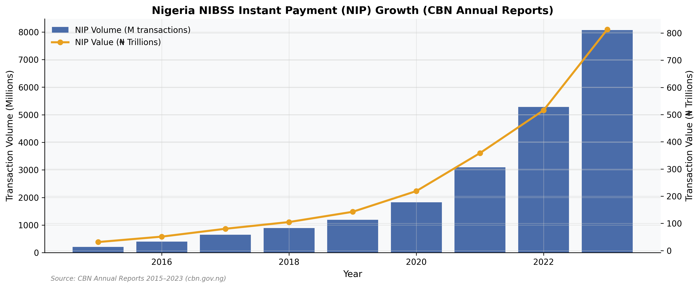
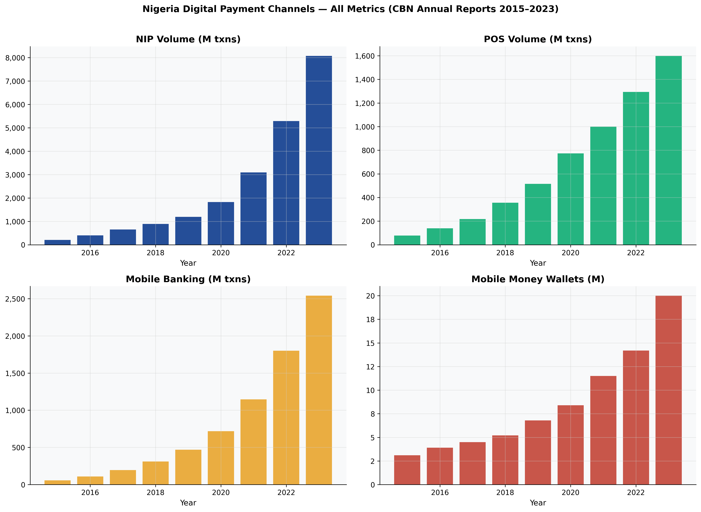
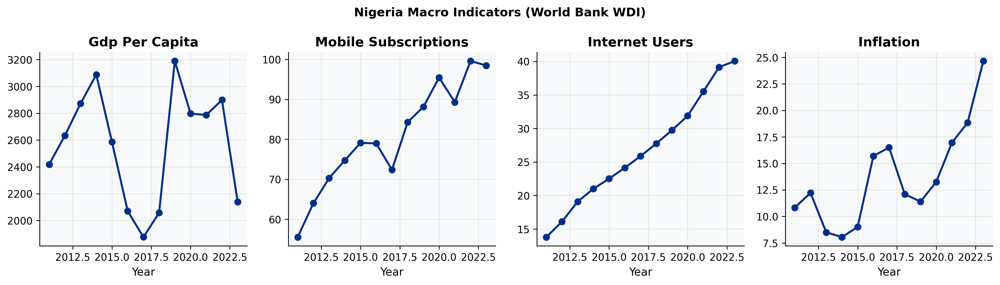
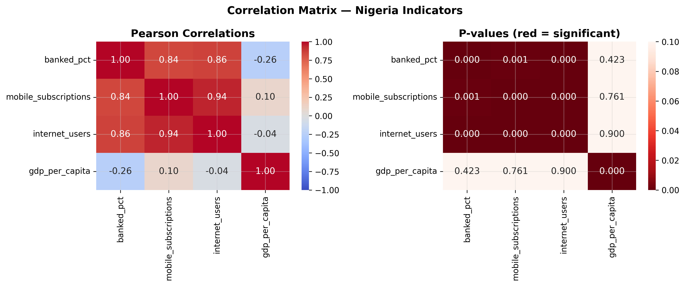

# Nigeria Digital Financial Services Market Analysis
## Strategic Entry Assessment and Financial Modelling Report

**Prepared by:** Peter Adepoju \
**Email:** petera@aims.ac.za

---

## Abstract

This project is a consulting-style market analysis of Nigeria's digital financial services sector.
It combines public data from the World Bank, CBN annual reports, EFInA surveys, and competitor disclosures to assess market opportunity, competitive intensity, financial upside, and strategic risk.

Key results:
- Nigeria had 45% formal bank account ownership in 2023, leaving about 26 million adults financially excluded.
- NIP transaction volume grew from 209 million in 2015 to 8.07 billion in 2023, implying roughly 58% annual growth.
- The model assumptions estimate TAM at $90.1B, SAM at $36.0B, and Year 3 SOM at $2.523B.

The repository includes ordered notebooks, a Streamlit dashboard, publication-ready figures and tables, and a full memorandum-style report.

---

## 1. Introduction

Nigeria is the largest economy in Africa and one of the most attractive DFS markets on the continent.
At the same time, financial inclusion remains incomplete, digital payment rails continue to expand, and competition among fintech and payment players is intense.

This project asks:

1. How large is the addressable opportunity in Nigeria's DFS market?
2. What do inclusion trends and payment-growth trends suggest about timing?
3. How concentrated is the competitive landscape?
4. What are the key commercial and regulatory risks?
5. Which entry strategy is most plausible for a new market participant?

Hypotheses:

- Financial inclusion improvements will coexist with strong digital-payment growth.
- The market will be large enough to support a focused new entrant, but not without meaningful regulatory and competitive risk.
- A USSD-first and agent-network-led strategy will be more practical than a smartphone-only launch.

---

## 2. Data

- World Bank World Development Indicators
- EFInA Access to Finance survey series
- CBN annual reports and payment statistics
- Competitor public disclosures and press releases

### Included data files

- `data/raw/wb_indicators_raw.csv`
- `data/external/cbn_payments.csv`
- `data/external/efina_summary.csv`
- `data/external/competitors.csv`

### Processed outputs

- `data/processed/nigeria_combined.csv`
- `data/processed/competitors_processed.csv`
- `data/processed/financial_model.xlsx`

### Data notes

- The analysis uses only public and traceable sources.
- Where exact values are not available, the report clearly labels assumptions.
- The project is intentionally built as a reproducible consulting case study rather than a live client memo.

---

## 3. Methods

### 3.1 Data collection and cleaning

- Downloaded and standardized public macro, inclusion, payments, and competitor data.
- Harmonized units, date ranges, and field names across sources.
- Built analysis-ready tables for the report, figures, and financial model.

### 3.2 Market sizing

- Estimated TAM, SAM, and SOM using a bottom-up framework.
- Documented assumptions in `configs/config.yaml`.
- Produced sensitivity tables to test model robustness.

### 3.3 Competitive and risk analysis

- Benchmarked major DFS players using publicly disclosed indicators.
- Computed concentration and strategic positioning views.
- Built a 5x5 risk matrix with probability-impact scoring.

### 3.4 Financial modelling

- Built a three-year operating model.
- Projected revenue by stream, costs, EBITDA, and valuation scenarios.
- Generated sensitivity analysis for key business assumptions.

---

## 4. Results

### 4.1 Financial inclusion and payment growth






The inclusion trend shows progress, but also a large remaining exclusion gap.
At the same time, NIP growth indicates that the payment infrastructure is already large enough to support new financial products.

### 4.2 Macro context




Nigeria still trails peers such as Kenya and South Africa on formal account ownership, which supports the case for continued DFS expansion.

### 4.3 Market sizing


| Metric | Value | Source |
|--------|-------|--------|
| Nigeria adult population (2023) | 106 million | World Bank 2023 |
| Formally banked (2023) | 45% | EFInA 2023 |
| Financially excluded | ~26 million adults | EFInA 2023 |
| Mobile money wallets (2023) | 20 million | CBN 2023 |
| NIP volume (2023) | 8.07 billion transactions | CBN Annual Report 2023 |
| NIP value (2023) | NGN 813 trillion | CBN Annual Report 2023 |
| NIP CAGR (2015-2023) | 58% | Calculated |
| TAM | $90.1B | Assumption |
| SAM | $36.0B | Assumption |
| SOM year 3 | $2.523B | Assumption |

### 4.4 Competitive landscape


The market appears moderately concentrated and operationally competitive.
That means a new entrant needs a clear wedge, not a generic "me-too" proposition.

### 4.5 Financial model


The model suggests that growth, unit economics, and cost discipline all matter at once.
Revenue expands meaningfully under the base case, but profitability remains sensitive to key assumptions.

### 4.6 Risk and strategic opportunity




The highest-priority risks include FX volatility, regulatory uncertainty, and execution complexity.
The most attractive opportunities are those aligned with inclusion gaps and low-friction distribution.

---

## 5. Discussion

1. Nigeria offers a large DFS opportunity, but it is not an easy market to enter.
2. Inclusion trends and payment growth both support the case for market expansion.
3. Competitive intensity means distribution and compliance are core moats.
4. The financial model is attractive only under disciplined assumptions.

Recommendations:

1. Prioritize a USSD-first and agent-network-led launch.
2. Focus first on financially underserved mass-market users.
3. Treat compliance, licensing, and risk controls as strategic assets.
4. Use the market-sizing and sensitivity tables as decision tools, not as forecasts.

---

## 6. Limitations

- Competitor user counts are self-reported and not independently audited.
- Financial outputs are assumption-driven and should not be treated as forecasts.
- Some inclusion series are interpolated from biennial survey data.
- FX and regulatory assumptions can change quickly.

---

## 7. Reproducibility

```bash
python -m venv .venv
.venv\Scripts\activate
pip install -r requirements.txt
python scripts/download_data.py
make notebooks
streamlit run dashboard/app.py
```

If you prefer conda:

```bash
conda env create -f environment.yml
conda activate nigeria-dfs
```

---

## 8. Project Structure

```text
nigeria_dfs_analysis/
|-- configs/                  # Assumptions and configuration
|-- dashboard/                # Streamlit dashboard
|-- data/                     # Raw, external, interim, and processed data
|-- notebooks/                # Ordered notebook workflow
|-- paper_or_report/          # Full report and supporting material
|-- reports/                  # Generated figures and tables
|-- scripts/                  # Download and pipeline scripts
|-- src/                      # Reusable Python modules
|-- tests/                    # Automated tests
|-- Makefile
|-- requirements.txt
|-- environment.yml
`-- README.md
```

---

## 9. Figures

The most important report figures are included below:

- [Financial inclusion trend](reports/figures/fig01_financial_inclusion_trend.png)
- [NIP payment growth](reports/figures/fig02_nip_payment_growth.png)
- [Payment channels dashboard](reports/figures/fig03_payment_channels_dashboard.png)
- [Cross-country inclusion](reports/figures/fig04_cross_country_inclusion.png)
- [Market sizing funnel](reports/figures/fig06_market_sizing_funnel.png)
- [Competitive landscape](reports/figures/fig08_competitive_landscape.png)
- [Risk matrix](reports/figures/fig14_risk_matrix_heatmap.png)
- [Strategic opportunity matrix](reports/figures/fig15_strategic_opportunity_matrix.png)

---

## 10. Report and Demo

- [Full report](paper_or_report/report.md)
- [Limitations note](paper_or_report/limitations.md)
- [Datasheet](paper_or_report/datasheet.md)
- [Model card](paper_or_report/model_card.md)

The report is written in an information-memorandum style, with supporting figures and tables stored alongside the notebook outputs.

---

## 11. License

MIT License
