# Nigeria Digital Financial Services Market Analysis
## Strategic Entry Assessment and Financial Modelling Report

**Prepared by:** Peter Adepoju \
**Email:** petera@aims.ac.za

**Version:** 1.0 (Portfolio / Case Study)  
**Classification:** Illustrative - Not for Client Distribution

---

## Executive Summary

This report assesses the size, structure, and strategic attractiveness of Nigeria's
digital financial services market using public data from the World Bank, EFInA,
CBN annual reports, and competitor disclosures.

Key results:

| Finding | Metric | Source |
|---------|--------|--------|
| Financial inclusion rate (2023) | 45% | EFInA Access to Finance Survey 2023 |
| Financially excluded adults | ~26 million | EFInA 2023 |
| NIP volume (2023) | 8.07 billion transactions | CBN Annual Report 2023 |
| NIP value (2023) | NGN 813 trillion | CBN Annual Report 2023 |
| NIP CAGR (2015-2023) | 58% | Calculated |
| Estimated TAM | $90.1B | Assumption |
| Estimated SAM | $36.0B | Assumption |
| Estimated SOM year 3 | $2.523B | Assumption |

The strategic implication is clear: Nigeria remains a very large DFS opportunity,
but the right entry strategy is a focused one. A USSD-first, agent-network-led
launch is more plausible than a smartphone-only proposition, and compliance plus
distribution are the key moats.

---

## 1. Introduction and Background

### 1.1 Engagement Context

This analysis was conducted as a simulation of a management consulting engagement
for the Strategy Advisory and Financial Modelling service lines at a firm such as
Therbo Consulting Limited. The hypothetical client is a growth-stage investor or
strategic acquirer evaluating entry into Nigeria's digital financial services market.

### 1.2 Scope

- Geography: Federal Republic of Nigeria
- Sector: Digital financial services, including mobile banking, mobile money,
  payments infrastructure, and digital lending
- Time horizon: Historical data 2015-2023; projections 2024-2026
- Deliverables: Market sizing, competitive landscape, financial model,
  risk assessment, strategic recommendations

### 1.3 What This Report Does Not Cover

- Regulatory licensing process, which requires specialist legal counsel
- Technology architecture and vendor selection
- Human capital strategy beyond high-level cost assumptions
- Country-by-country analysis outside Nigeria

---

## 2. Macroeconomic and Industry Context

### 2.1 Nigeria's Economic Position

- GDP: about $440B
- Population: about 220M
- Adult population (15+): about 106M
- GDP per capita: about $2,000
- Inflation in 2023: above 20%
- Mobile subscriptions and internet use remain important enablers of DFS adoption

### 2.2 Regulatory Environment

The Central Bank of Nigeria governs DFS through several frameworks:

- Bank and Other Financial Institutions Act (BOFIA) 2020
- Payment Service Bank guidelines
- CBN Innovation Lab sandbox
- Nigerian Data Protection Regulation
- eNaira as the government-backed digital currency

*Risk note:* CBN policy is active and frequently updated. Regulatory risk is rated
Critical in the risk matrix (Section 6).

---

## 3. Financial Inclusion Analysis

### 3.1 EFInA Survey Trend (2008-2023)

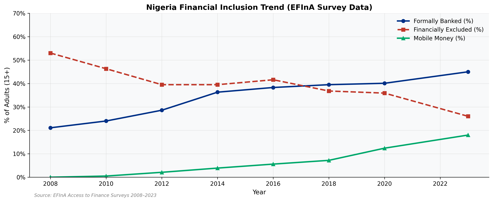

*Figure 1: Nigeria financial inclusion trend. Source: EFInA Access to Finance Surveys 2008-2023.*

Key observations:

- Formally banked adults rose from 21.1% in 2008 to 45.0% in 2023
- Financially excluded adults fell from 53% to 26% over the same period
- Mobile money adoption accelerated sharply after 2020

### 3.2 Cross-Country Benchmarking

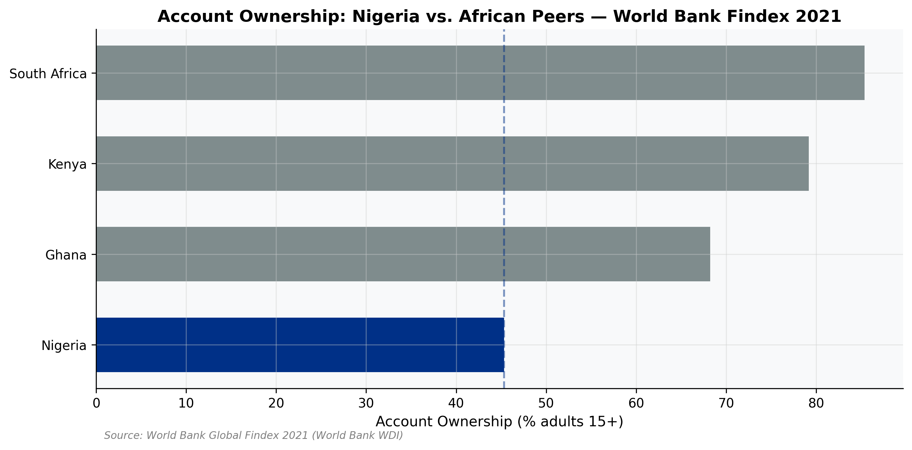

Nigeria's 45% account ownership rate compares unfavourably to Kenya, South Africa,
and Ghana. That gap represents the opportunity: Nigeria is the largest economy in
Sub-Saharan Africa with substantial room to move toward the frontier.

---

## 4. Market Sizing

### 4.1 Methodology

A bottom-up approach is used:

```text
TAM = Total Nigerian adults (15+) x Average annual digital transaction value per adult
SAM = Smartphone-enabled adults with mobile internet x same ARPU
SOM = Realistic share of SAM capturable by a single new entrant
```

All assumptions are documented in `configs/config.yaml`.

### 4.2 Results

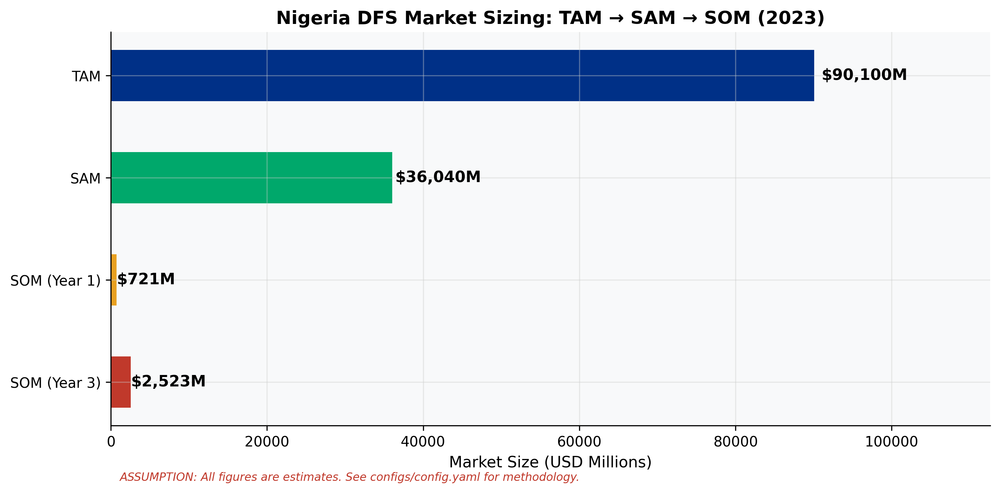

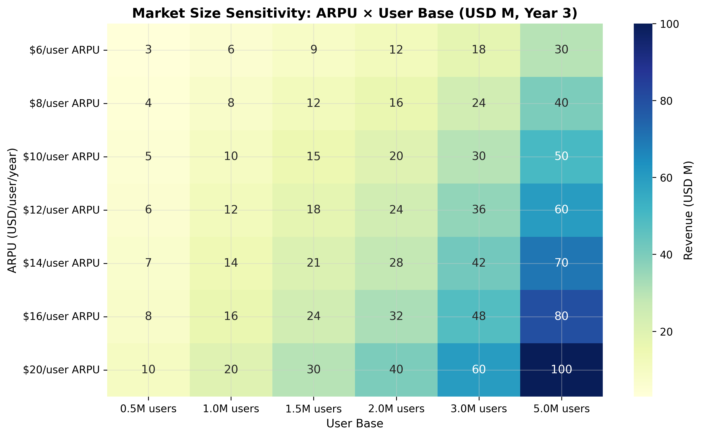

Sensitivity analysis shows that the estimate is most sensitive to the ARPU
assumption. The market is large under the base case, but the estimate should be
read as an assumption-driven sizing exercise rather than a forecast.

---

## 5. Competitive Landscape

### 5.1 Market Structure

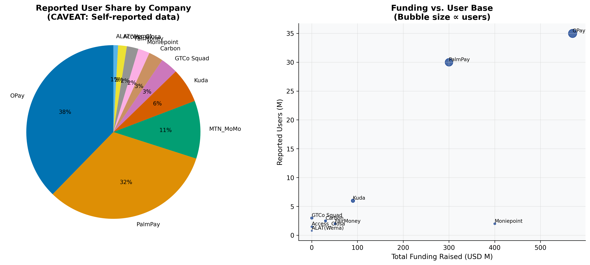

The Nigeria DFS market is moderately concentrated, with a small number of
large players controlling a substantial share of reported users.

### 5.2 Porter's Five Forces

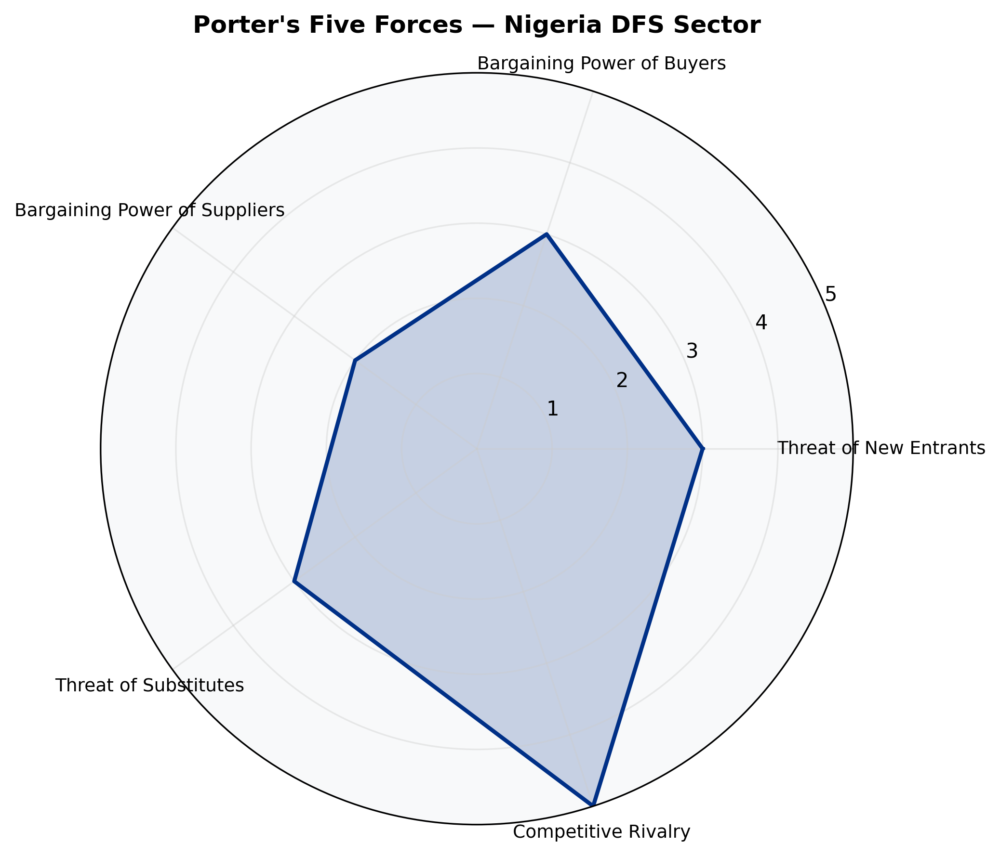

Competitive rivalry is high. Threat of new entrants is moderate, because CBN
licensing creates barriers but does not fully prevent well-capitalised entrants
from competing.

---

## 6. Risk Assessment

### 6.1 Risk Matrix

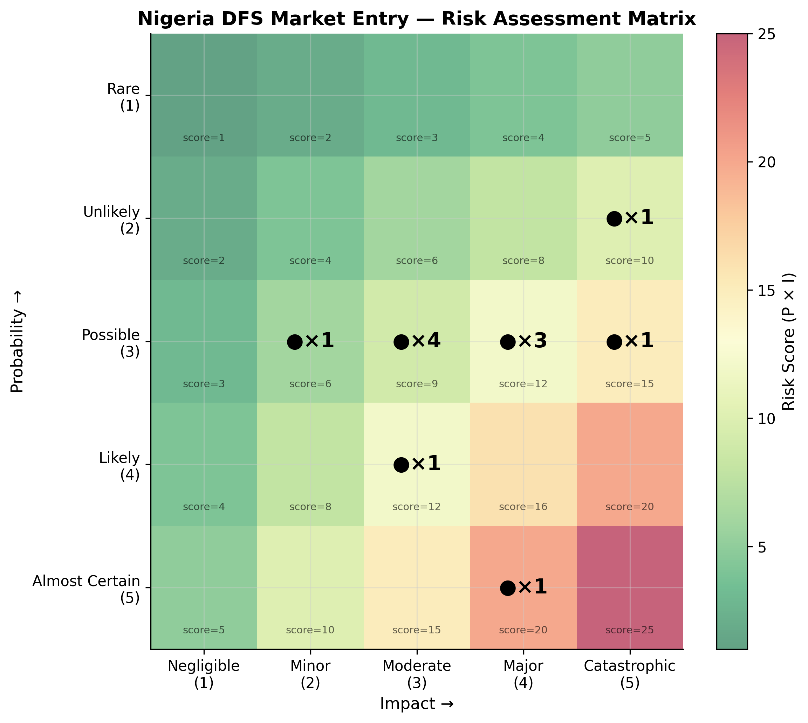

### 6.2 Strategic Opportunities

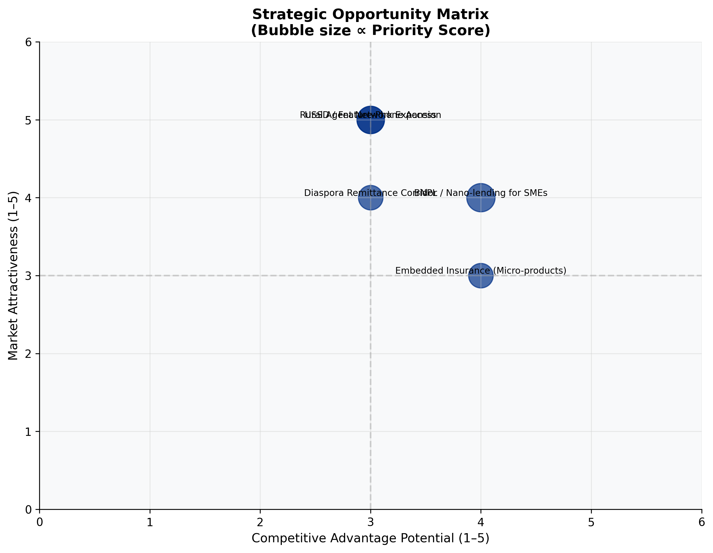

The highest-priority risks include FX volatility, regulatory uncertainty, and
execution complexity. The strongest opportunities are aligned with inclusion
gaps and low-friction distribution.

---

## 7. Financial Model

### 7.1 Model Structure

The three-year financial model is built in Python and exported to Excel at
`data/processed/financial_model.xlsx`.

Model structure:

1. User growth module
2. Revenue module
3. Income statement
4. Sensitivity analysis
5. Valuation module

### 7.2 Base Case Projection

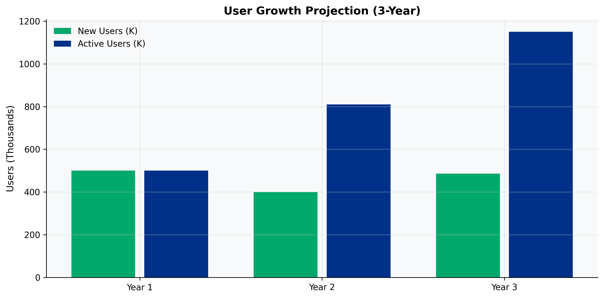

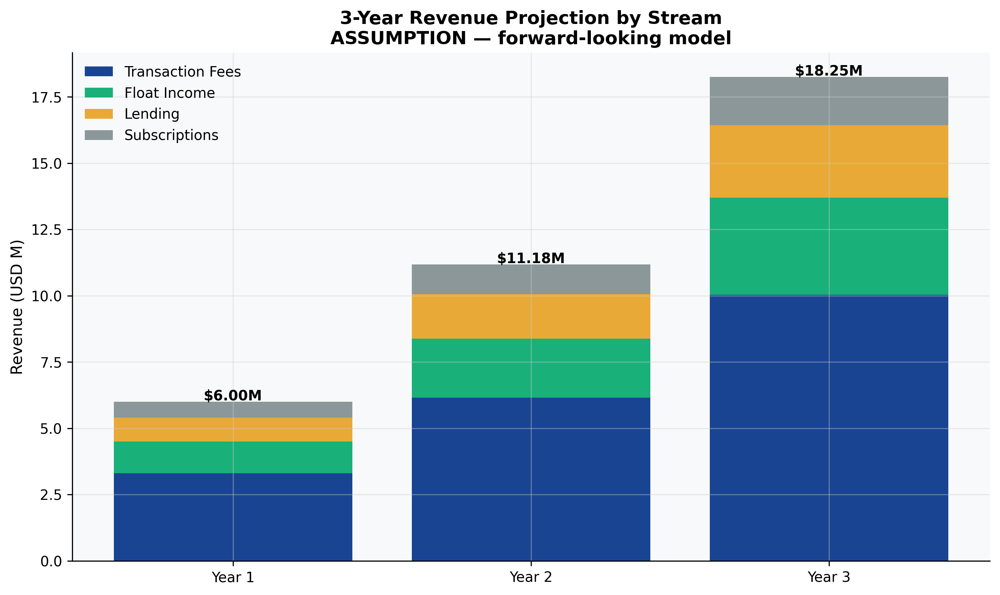

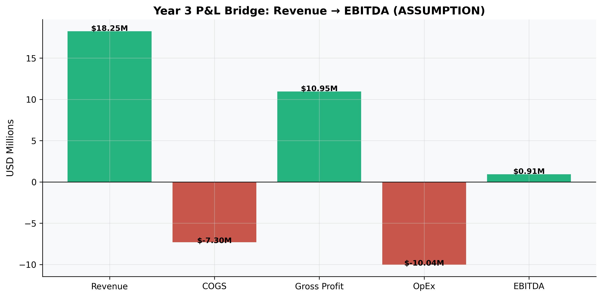

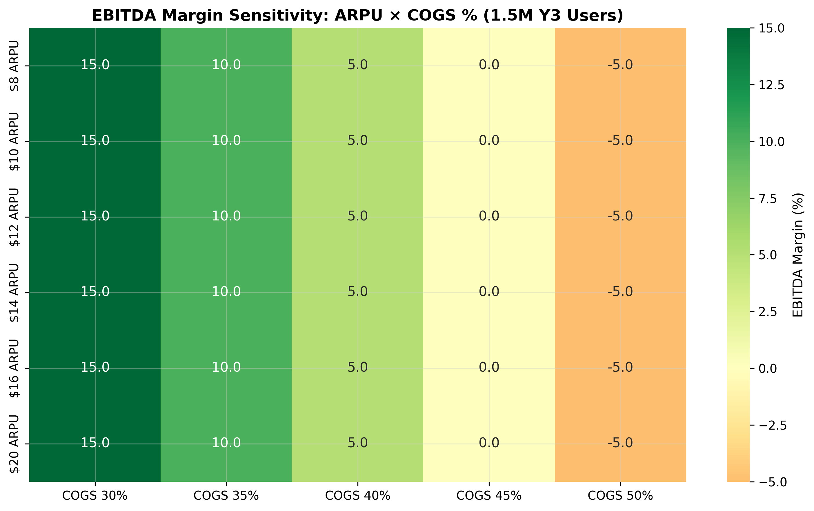

The model suggests that growth, unit economics, and cost discipline all matter at
once. Revenue expands under the base case, but profitability remains sensitive to
key assumptions.

---

## 8. Strategic Recommendations

### 8.1 Market Entry Framework

Based on the analysis above, the recommended market entry approach is:

**Phase 1 - Foundation**
- Secure the required licence and compliance setup
- Build a USSD-first product
- Recruit an initial agent network in major cities

**Phase 2 - Growth**
- Add nano-lending and savings products
- Expand the agent network nationwide
- Use alternative-data scoring to support underwriting

**Phase 3 - Scale**
- Add embedded insurance and SME products
- Expand cross-border and premium offerings
- Target EBITDA breakeven through scale and efficiency

### 8.2 Priority Actions

| Action | Owner | Timeline | Investment Required |
|--------|-------|----------|---------------------|
| Engage CBN Innovation Lab | CEO + Legal | Month 1 | Low |
| Appoint Chief Compliance Officer | CEO | Month 1 | Moderate |
| USSD partner agreement | CTO | Months 1-3 | Moderate |
| Build agent recruitment pipeline | COO | Months 2-6 | High |
| Alternative data scoring model | CTO + Data | Months 3-9 | Moderate |
| ISO 27001 certification | CISO | Months 6-12 | Moderate |

---

## 9. Limitations

Key limitations of this report:

1. Competitor user figures are self-reported and not independently verified
2. Financial model outputs are assumption-driven, not based on actual operations
3. EFInA survey data is biennial, so annual trend lines involve interpolation
4. FX assumptions carry significant uncertainty
5. No primary research interviews or surveys were conducted

---

## 10. Reproducibility

This report was generated from a reproducible Python project:

```bash
git clone <repo>
cd nigeria_dfs_analysis
pip install -r requirements.txt
python scripts/download_data.py
make notebooks
streamlit run dashboard/app.py
```

All analysis code is in `notebooks/` and `src/`. The figures and tables in this
report are generated from the project outputs.

---

## References

1. EFInA. (2023). Access to Finance Survey 2023.
2. Central Bank of Nigeria. (2023). Annual Report 2023.
3. World Bank. (2023). World Development Indicators.
4. NIBSS. (2023). Annual Activity Report 2023.

---

*This report is produced as a portfolio project simulating a management consulting
engagement. It is not intended for investment decisions.*
